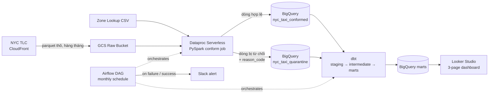

# NYC Taxi Analytics — Big Data Pipeline trên GCP

[](https://github.com/Nhut-Data/nyc-taxi-analytics/actions/workflows/spark_lint_test.yml)
[](https://github.com/Nhut-Data/nyc-taxi-analytics/actions/workflows/dbt_ci.yml)
[](https://github.com/Nhut-Data/nyc-taxi-analytics/actions/workflows/airflow_lint.yml)

Pipeline xử lý dữ liệu chuyến đi taxi NYC (NYC TLC Trip Data) end-to-end:
từ ingest file thô, xử lý phân tán bằng Spark trên Dataproc Serverless,
data quality gate với quarantine pattern, transform bằng dbt trên
BigQuery, tới dashboard Looker Studio 3 trang — toàn bộ được orchestrate
bởi Airflow và có CI/CD tự động qua GitHub Actions.

Dataset và toàn bộ quyết định kiến trúc không phải chọn ngẫu nhiên — xem
[`docs/decisions/`](docs/decisions/) để hiểu lý do thật đằng sau từng
lựa chọn kỹ thuật.

## Kiến trúc



## Business questions dashboard trả lời

| Page | Câu hỏi | Nguồn dữ liệu |
|---|---|---|
| 1 — Demand | Nhu cầu taxi biến động thế nào theo giờ/ngày/khu vực? | `agg_hourly_demand_by_zone` |
| 2 — Revenue & Tip | Doanh thu, tip% phân bổ ra sao theo khu vực/sân bay? | `agg_monthly_zone_revenue` |
| 3 — Data Quality | Tỷ lệ dữ liệu lỗi thật là bao nhiêu, loại lỗi nào chiếm ưu thế? | `agg_monthly_pipeline_health`, `agg_monthly_data_quality` |

## Dashboard trực tiếp

📊 [Xem dashboard Looker Studio](https://datastudio.google.com/s/sDWxe9efWnU)

## Video Demo

🎥 [Xem video demo pipeline chạy end-to-end](https://www.youtube.com/watch?v=p3kFgR0-ZbM)

## Tech stack

| Layer | Công nghệ |
|---|---|
| Ingestion | Python, `requests` (tải trực tiếp từ TLC CloudFront) |
| Xử lý phân tán | PySpark 3.5.3, Dataproc Serverless (runtime 2.3) |
| Data warehouse | BigQuery |
| Transform | dbt-bigquery 1.12.0 |
| Orchestration | Apache Airflow 3.3.0 (Docker Compose) |
| BI | Looker Studio |
| Alerting | Slack Incoming Webhook (qua Airflow task callback) |
| CI/CD | GitHub Actions, Workload Identity Federation (không dùng service account key) |
| Dev environment | Docker (`Dockerfile.spark-dev`) |

## Cấu trúc thư mục

```
├── airflow/dags/ # DAG chính + Slack callback
├── config/ # dev.yaml, prod.yaml — cấu hình theo môi trường
├── dbt/models/
│ ├── staging/ # Passthrough thuần từ bảng conformed
│ ├── intermediate/ # Business logic (metric, enrichment, DQ aggregate)
│ └── marts/ # Bảng cuối phục vụ Looker Studio
├── docs/
│ ├── data_dictionary.md
│ └── decisions/ # 6 ADR — lý do thật đằng sau từng quyết định
├── infra/ # Setup script: BigQuery, GCS, Dataproc config
├── ingestion/ # Tải file thô, build URL, load zone lookup
├── spark_jobs/
│ ├── jobs/ # conform_trips.py — job chính
│ ├── validations/ # rules.py — data quality rules
│ └── Dockerfile.spark-dev
├── tests/spark/ # pytest cho validation rules
└── .github/workflows/ # 3 workflow CI riêng biệt theo scope
```

## Data quality — Quarantine pattern

Thay vì âm thầm loại bỏ dòng lỗi, pipeline tách dữ liệu thành 2 nhánh dựa
trên kết quả validate, mỗi dòng bị từ chối đều có `reason_code` truy vết
được. Thứ tự ưu tiên rule (`null_datetime → wrong_period → invalid_fare →
invalid_duration → suspicious_distance → invalid_location_id`) được thiết
kế có chủ đích, không ngẫu nhiên — chi tiết đầy đủ và bằng chứng thực tế
tại [ADR-0004](docs/decisions/0004-quarantine-pattern.md).

Số liệu thật trên 1 tháng dữ liệu (2024-01, ~2.96 triệu dòng xử lý):

| reason_code | Số dòng | % trong tổng lỗi |
|---|---|---|
| `invalid_fare` | 39.840 | 97.89% |
| `invalid_duration` | 815 | 2.00% |
| `suspicious_distance` | 25 | 0.06% |
| `wrong_period` | 18 | 0.04% |
| **Tỷ lệ lỗi thật (rejected/tổng xử lý)** | | **1.37%** |

## CI/CD

3 workflow riêng biệt, mỗi cái chỉ trigger đúng phạm vi thay đổi (path
filter), tránh chạy CI không liên quan:

| Workflow | Trigger path | Việc làm |
|---|---|---|
| `spark_lint_test.yml` | `spark_jobs/`, `tests/`, `ingestion/` | Lint (black/flake8) + pytest + **tự động deploy lên GCS** khi merge `main` |
| `dbt_ci.yml` | `dbt/` | `dbt compile` + `dbt test` |
| `airflow_lint.yml` | `airflow/` | Lint + `DagBag().import_errors` — bắt lỗi parse DAG trước khi deploy |

Auth qua **Workload Identity Federation** — không có service account key
nào tồn tại trong hệ thống, tuân thủ org policy chặn tạo key file.
Quyền GCS cấp theo nguyên tắc least-privilege, scope đúng 1 bucket
(`roles/storage.objectAdmin` trên `nyc-taxi-raw-banking-500108`, không
cấp quyền toàn project).

## Architecture Decision Records

| ADR | Quyết định |
|---|---|
| [0001](docs/decisions/0001-dataset-choice-nyc-taxi.md) | Vì sao chọn NYC Taxi thay vì GA4/Yelp |
| [0002](docs/decisions/0002-spark-vs-dbt-boundary.md) | Ranh giới trách nhiệm Spark vs dbt |
| [0003](docs/decisions/0003-partition-cluster-strategy.md) | Partition/cluster strategy cho `fact_trips` |
| [0004](docs/decisions/0004-quarantine-pattern.md) | Thiết kế quarantine pattern + thứ tự ưu tiên rule |
| [0005](docs/decisions/0005-docker-spark-dev-environment.md) | Docker dev environment, BigQuery connector jar |
| [0006](docs/decisions/0006-slack-notification-callback.md) | Slack alerting qua Airflow task callback |
| [0007](docs/decisions/0007-explicit-partition-overwrite.md) | Kiểm soát tường minh overwrite thay vì phụ thuộc `partitionOverwriteMode` |

## Vấn đề kỹ thuật thật đã giải quyết

Không phải mọi thứ chạy đúng ngay từ đầu — đây là các bug thật đã gặp và
cách xử lý trong quá trình xây dựng:

| Vấn đề | Nguyên nhân gốc | Cách xử lý |
|---|---|---|
| Dữ liệu nhân đôi 7x sau nhiều lần chạy | Spark job dùng `.mode("append")`, chạy lại không xoá dữ liệu cũ | Đổi sang `overwrite`, verify idempotent bằng cách trigger lại DAG không xoá bảng — count giữ nguyên |
| `tip_percentage` lên tới 3016% trên dashboard | Không có ngưỡng fare tối thiểu, fare gần 0 làm phép chia bùng nổ | Thêm `MIN_FARE_AMOUNT = 2.5`, tip% đỉnh về mức hợp lý ~48% |
| 4 mốc thời gian rác trên trục X (2002, 2009...) | Dòng dữ liệu có `pickup_datetime` sai kỳ lẫn vào file đang xử lý | Thêm rule `is_valid_period()` + `reason_code = wrong_period` |
| Dataset BigQuery bị nhân đôi tên (`nyc_taxi_marts_nyc_taxi_marts`) | Macro mặc định `generate_schema_name` của dbt nối `target.schema` + `custom_schema_name` trùng nhau | Override macro, dùng đúng `custom_schema_name`, reconnect lại Looker Studio |
| Lệch Scala version trong Docker dev (`2.13` vs PySpark's `2.12`) | Copy nhầm bản connector khi setup ban đầu | Sửa đúng version + chuyển sang tải qua HTTPS lúc build thay vì commit binary 54MB |
| DAG hardcode `year, month = 2024, 1` | Code tạm để test, quên gỡ | Thay bằng `pendulum.subtract(months=2)` + override qua `dag_run.conf` cho demo |
| CI không tự trigger khi sửa chính file workflow | Path filter không bao gồm chính nó | Thêm path của chính file workflow vào `paths:`, kèm `workflow_dispatch` |
| `DagBag(include_examples=False)` lỗi trên Airflow 3.3.0 | Tham số bị loại bỏ theo kiến trúc DAG bundle mới | Tra release notes chính thức, bỏ tham số không còn tồn tại |
| BigQuery `overwrite` mode xoá sạch dữ liệu tháng khác khi backfill | `partitionOverwriteMode` mặc định STATIC (xoá toàn bảng); DYNAMIC không đáng tin theo nhiều báo cáo lỗi thật của connector | Tự `DELETE` đúng phạm vi partition bằng BigQuery client trước khi `append`, kiểm soát tường minh |
| `batch_id` trùng khi trigger DAG liên tiếp qua CLI | Template `{{ ts_nodash }}` không đảm bảo unique khi không truyền `--logical-date` tường minh | Kết hợp thêm `{{ dag_run.id }}` (khoá chính tự tăng), đảm bảo unique bất kể cách trigger |

## Chạy local

```bash
cp .env.example .env   # điền giá trị thật — xem hướng dẫn trong từng comment

make airflow-up        # Airflow UI: http://localhost:8080
make spark-test         # pytest cho validation rules, chạy trong Docker
make dbt-run             # dbt run
make dbt-test            # dbt test
make upload-jobs         # deploy spark_jobs lên GCS (thường qua CI, chạy tay khi cần)
```

Xem toàn bộ lệnh: `make help`.

## Hạn chế đã biết (demo scope)

- Pipeline đã backfill đầy đủ 12 tháng (2024-01 → 2024-12, ~40 triệu
  dòng), đủ để các chart "trend theo thời gian" có ý nghĩa thống kê thật,
  không chỉ demo hình thức.
- `MIN_FARE_AMOUNT = 2.5` là ngưỡng an toàn xấp xỉ, chưa đối chiếu số quy
  định chính thức của TLC — xem ghi chú tại ADR-0004.

## Tác giả

Nhựt — Data Engineering student, Việt Nam.
GitHub: [Nhut-Data](https://github.com/Nhut-Data)
